# Minutes of Meetings

Maintained by: Amir Nurmukhambetov (1930907)

## Eleventh Meeting [16 May 2024]

In the morning, Balint, Amir (me), Eusebiu went to item shop to gather missing parts. While waiting in the line, Amir (me) fleshed out documentations.

## Tenth Meeting [15 May 2024]

Today, we met up with the neigbouiring team to discuss how we should do the communication challange. We explained our concept of NFC tags and our current progress with it.

In tangent we found out our current NFC stickers are too big (25 mm) for the baggages (20 mm), which would be a problem in the future, but right now we have to understand how to work with them.

Amir (me) started to list out missing parts that we need for tomorrows item shop.

**missing parts**

- block 30
- block 15
- gear wheel T20 (Art no. 031021)
- Servo lever (Art no. 132004)
- Driver servo arm (Art no. 203658)
- Cog wheel Z10 M1,5 (Art no. 035112)
- Collet chuck (Art no. 035113)

Amir (me), Balint, Eusebiu discussed how the software integration with physical parts and digital parts could be abstracted so that it would be easier to iterate without changing much code between two.

Balint, Eusebiu, and Ibrahim worked on digital model. We met an issue with git version control. After which Amir (I) joined to help out with it also.

Then, we have worked on fleshing out documents for tomorrows deadline.

## Ninth Meeting [13 May 2024]

Today, during the beginning of the meeting we couldn't find the locker with parts. But after a while we found them.

Balint, Joep continued working with NFC.

Eusebiu, Ibrahim continued working on making digital model of the prototype.

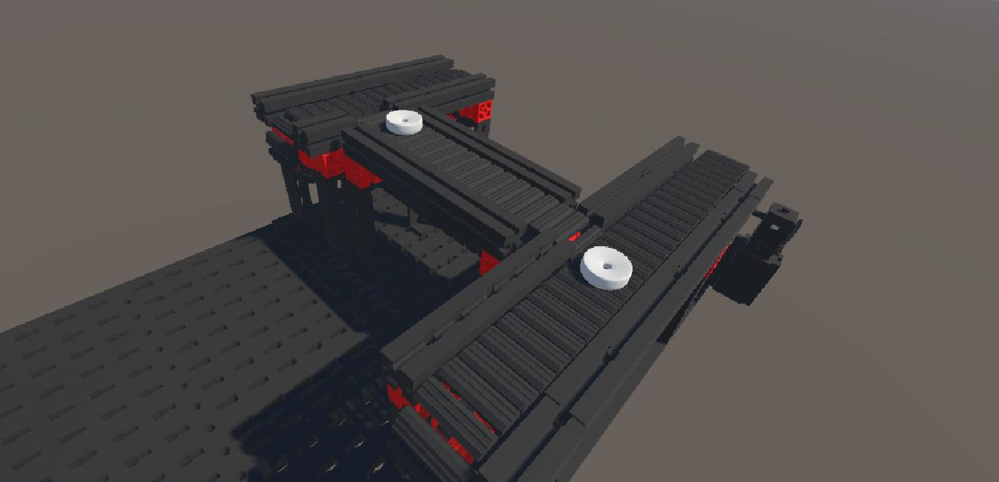

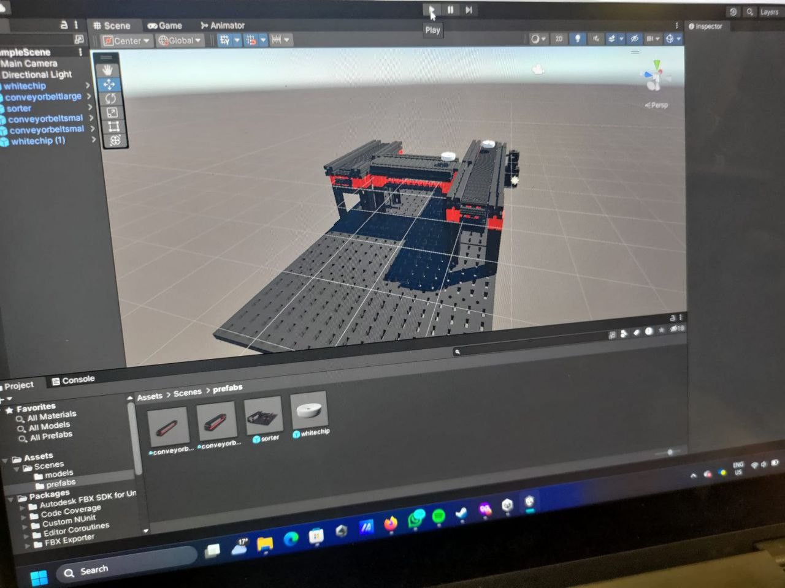

Alexia and Amir (me) worked on implementing design. We have noticed that sometimes the conveyer belts get caught and start to jam. We have lowered one of the conveyer belts + changed structure of the design.

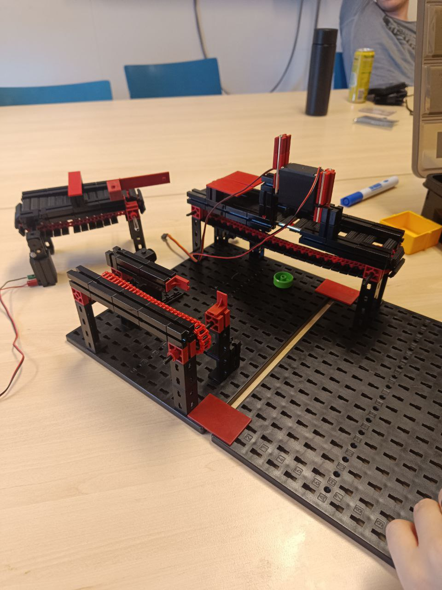

## Eighth Meeting [7 May 2024]

Today unfortunately the raspberry pi got broken, so we had to get a replacement for it. Balint configured the new raspberry pi again to got working as previous.

A possible problem which might have caused this is inproper wiring which caused it to short circuit. We would be more careful next time.

Joep finished working on the prototype design (working belts) but we couldn't test if it works because of current raspberry pi issue.

Ibrahim, Alexia, Eusebiu continued working on Unity.

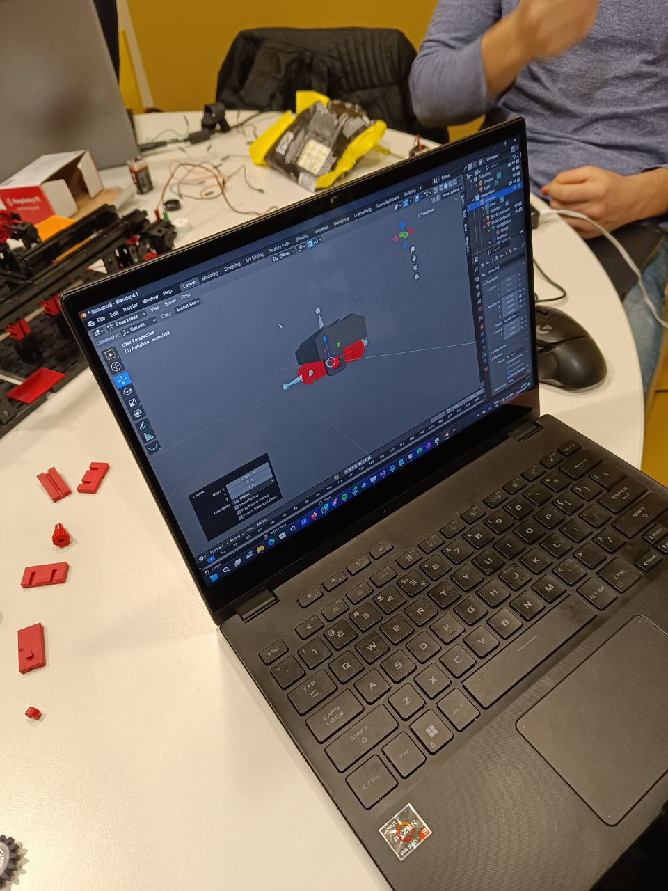

Joep worked on how NFC works, we managed to write data to the NFC tag.

## Seventh Meeting [6 May 2024]

Today, Eusebiu, Alexia, and Ibrahim continued working on Unity (Digital Twinning Challenge).

Amir (me) and Joep started on implementing figma design in real life.

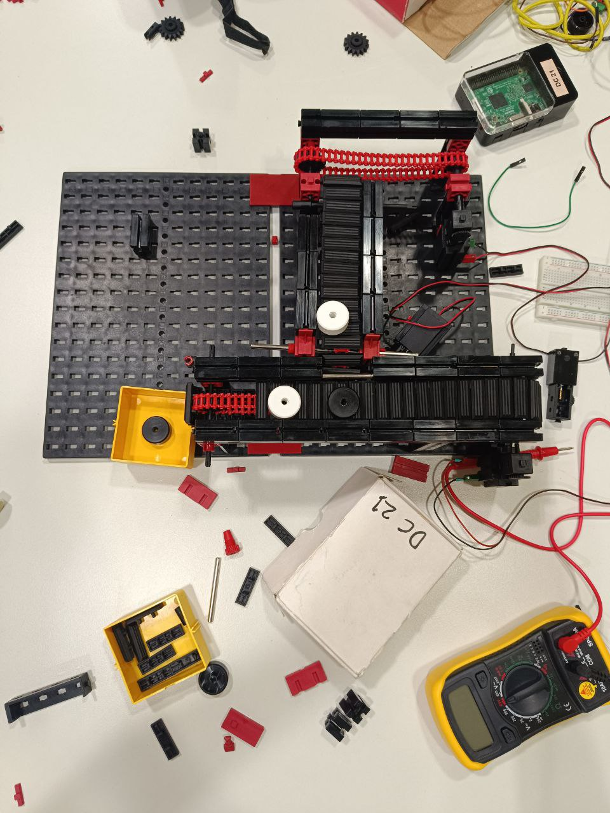

Balint continued working on motors and software related part.

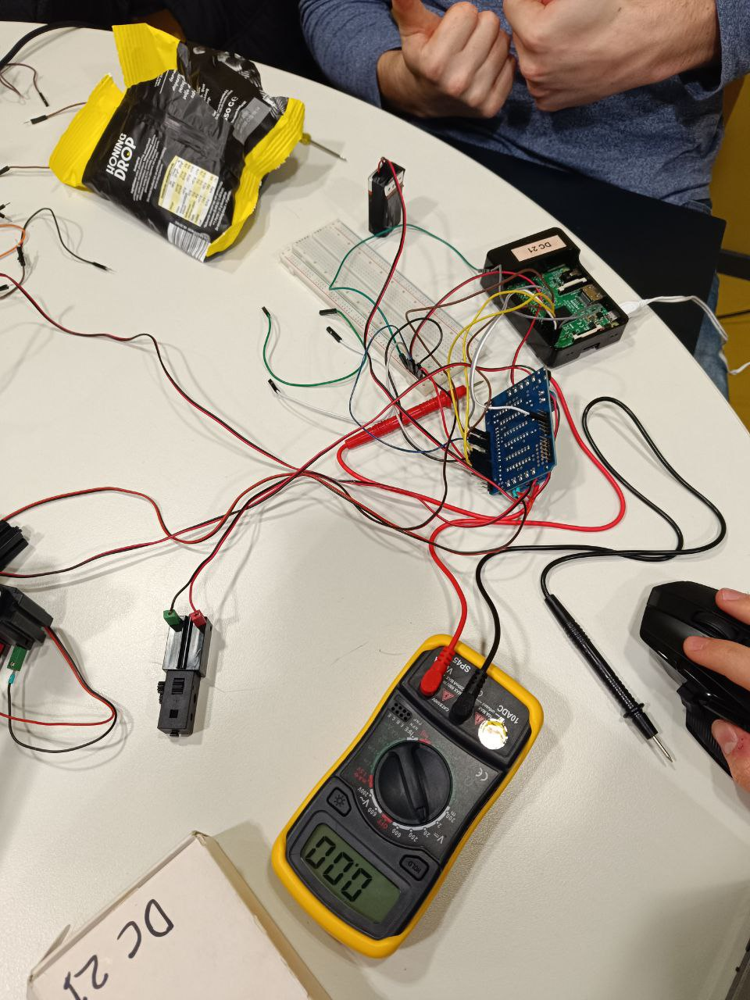

## Sixth Meeting [3 May 2024]

Today, we did the retrospective part of the meeting. After that we discussed the new model and progress of our project with Georgi. Georgi told us that we should distribute the tasks and everyone should assign themselves on a task on trello

Joep built two more conveyor belt parts.

Afterwards, Balint adjusted the code to operate multiple motors we attempted to make 4 motors work simultaneously. Although 2 motors successfully ran together. We could not manage to get 4 of them working at the same time.

Some debugging attempts later Balint managed to get 4 motors working simultaneously.

## Fifth Meeting [30 Apr 2024]

Today we discussed the privoted idea with Georgi and it was approved with some slight modifications (renaming things etc).

Balint got the motor and servo working with PWM and continuous motion. After which he started writing documentation on his work. It can be found on this [repo](https://github.com/2IO75-group-34/friendly-guacamole)

Eusebiu and Alexia completed the backlog.

I (Amir) and Joep worked on redesigning the robot so that it was more realistic in scale and used less parts. This allowed us to have a better understanding of what parts we need.

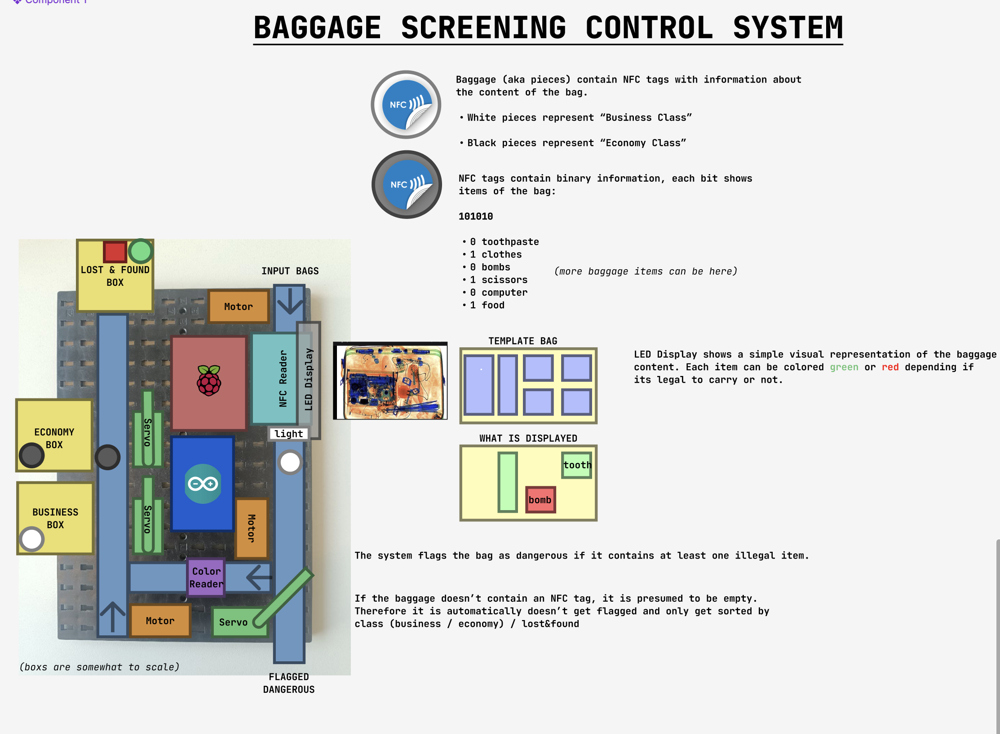

Joep, Balint, Amir, and Eusebiu started working on making a prototype design for the conveyer belt.

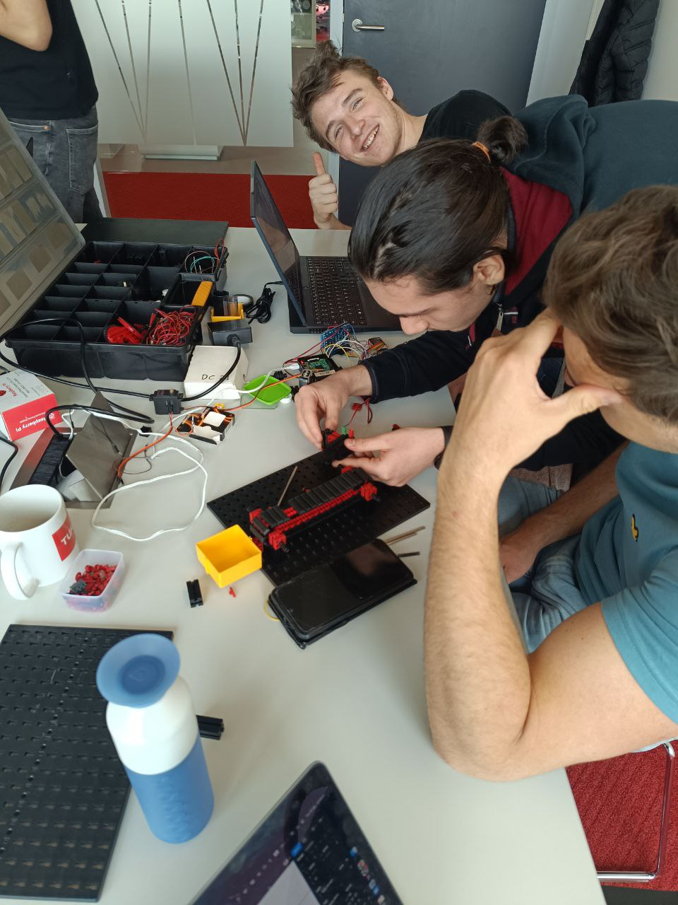

After which Eusebiu recorded a pitch video demonstration of our idea.

- [Youtube link](https://www.youtube.com/watch?v=dQw4w9WgXcQ)

## Fourth Meeting [29 Apr 2024]

Georgi has notified us that the idea **Hangman** doesn't represent a airport baggage system. We have pivoted the idea towards **baggage screening control system**.

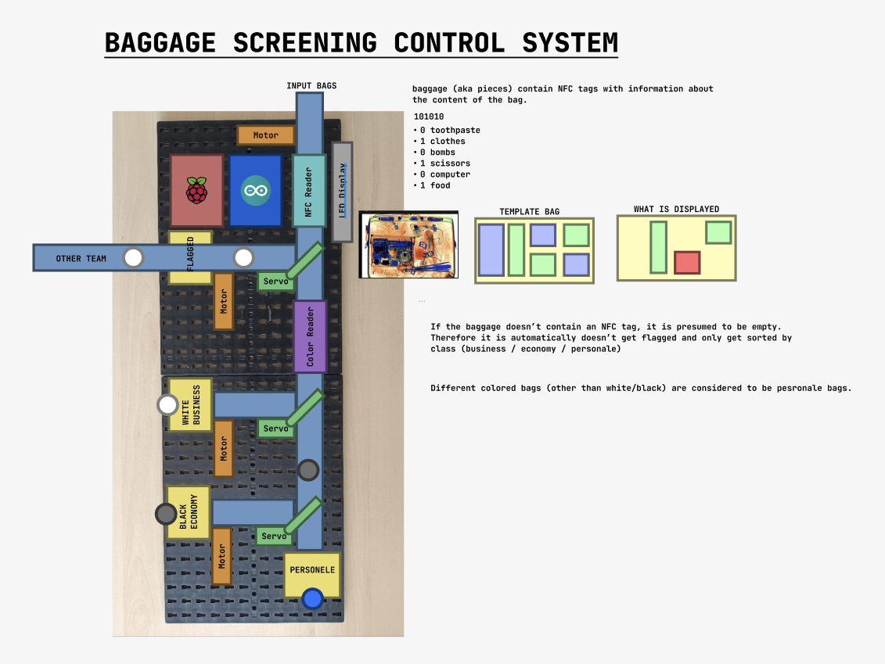

The basic premise of this idea is that the baggages are checked for their content. If the system detects a malliscious item then it gets flagged and is sent to the other team (or placed into flagged box). If the baggage is good, it get sorted into to classes: business and economy. If the bag is special it is considered to be personale baggage.

Balint got the LED to work with the raspberry pi and arduino board. Motors and servos are in process, the current issue that we are facing is that the power for them are not compatible with the arduino board and raspberry pi.

Joep, Eusebiu and Alexia worked on filling out the backlog.

## Third Meeting [26 Apr 2024]

- Everyone has done scrum quiz.

- Eusebiu and Alexia started to document scrum planning. While everyone suggests their thought.

- We have decided on tackle these challanges:
  - Simulation-in-the-loop testing and digital twinning
  - Communication protocols

- Everyone worked on filling out the rubric (based on the challanges mentioned above).

- Mentor agreed on idea **Hangman**

We brought the parts from the locker to play with it. Balint decided to start to configure arduino board to work with the raspberry pi so that the motors work. The rest watched a video showcasing how to connect and assemble FischerTechnik pieces.

Video(s):

- [How to Use FischerTechnik Systems](https://www.youtube.com/watch?v=OtKxWEv9YuA)

At the end, Balint took raspberry pi and arduino board home to work on it in more. I (Amir) took all pieces to see whats possible and how viable our idea. Eusebiu and Alexia decided to start learning how to 3D model.

## Second Meeting [24 Apr 2024]

Went through ideas:

### Binary Addition

**Init idea:**

two sequences of baggages representing each number are added and the result is displayed as a sequence of baggages. Then its get sorted.

**Possible issues:**

- How do we determine when the sequence is stopped for a certain number?
  - **Solution(s):**
  - A set sequence of 8bit would be inputted.
  - If no baggage is received for after a certain threshold then it is considered as black = 0.
  - We won't limit ourselves to two numbers, any amount can be possible.

- A situation may occur where the number of white or black baggages are not enough to represent the summed result.
  - **Solution(s):**
  - Display the result using an LED screen display.

- How do we resolve if the baggages arrive too quickly? More specifically they are clustered and the space in between each baggage is different.
  - **Solution(s):**
  - Don't disturb the sequence make sure the **color reader** is fast enough to determine bit.

- Since the reviewer doesn't control the input the sequence is random. And so the result of addition can't be controlled.
  - **Solution(s):**
  - Before adding the sequence display the number that the 8bit chunk represents.

**Revised edition:**

Robot that reads a sequence of baggages in white/black. Each bag represents a bit either 1 or 0 depending on its color. A sequence is split in 8bit chunks and all are summed. The result is displayed on a LED screen display, and latest number added is shown. After processing the bagges are sorted by color.

### Alphabet Sorter

**Init idea:**

A sequence of baggages with english letters on each are inputted. The robot determines which letter is on each baggage after which stores is in a basket for a specific letter. The user would input the word they would like to display, after which the robot would output baggages with letters in a specific order such that the sequence shows the text user inputted.

**Possible issues:**

- The english alphabet contains 26 letters, this would involve 26 containers for storage, this would take too much space.
- The robot must be autonamous, but this has a user prompt in the middle of the task, which is not allowed.
- What happens if the baggage doesn't contain a letter, or contains a symbol that the storage can't be place.

### HangMan

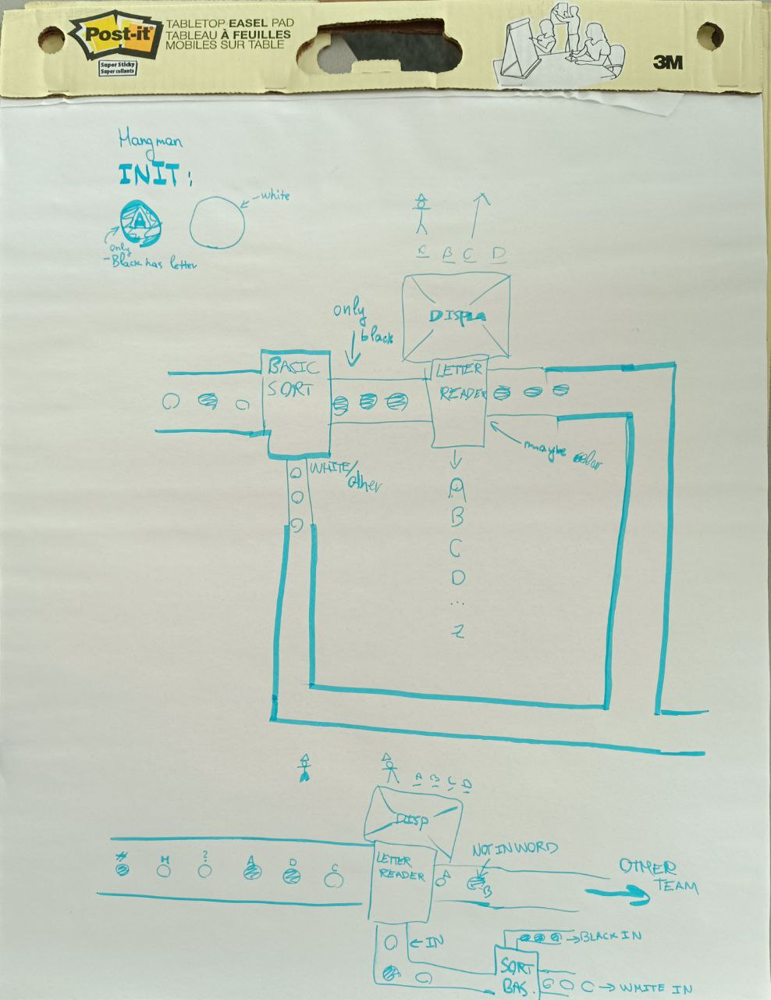

**Init idea:**

A sequence of baggages with english letters on each. A robot determines the letter on a bag. A screen display of the hangman game. The determined letter is checked if its contained in the word choosen, if true then the baggages are sorted by color, else if the letter is not in the word, the robot ignores them.

**Possible issues:**

- How do we determine the word for the hangman game? What happens if the word is guessed correctly?
  - **Solution(s):**
  - The robot contains a word pool from which it selects randomly.
- How to handle letters that can't be recognized?
  - **Solution(s):**
  - The baggage is set as not in word.
  - Perhaps the robot could display a recognition percentage. Showing how likely it thinks that the letter on the bag is a certain letter.

### Connect Random 4

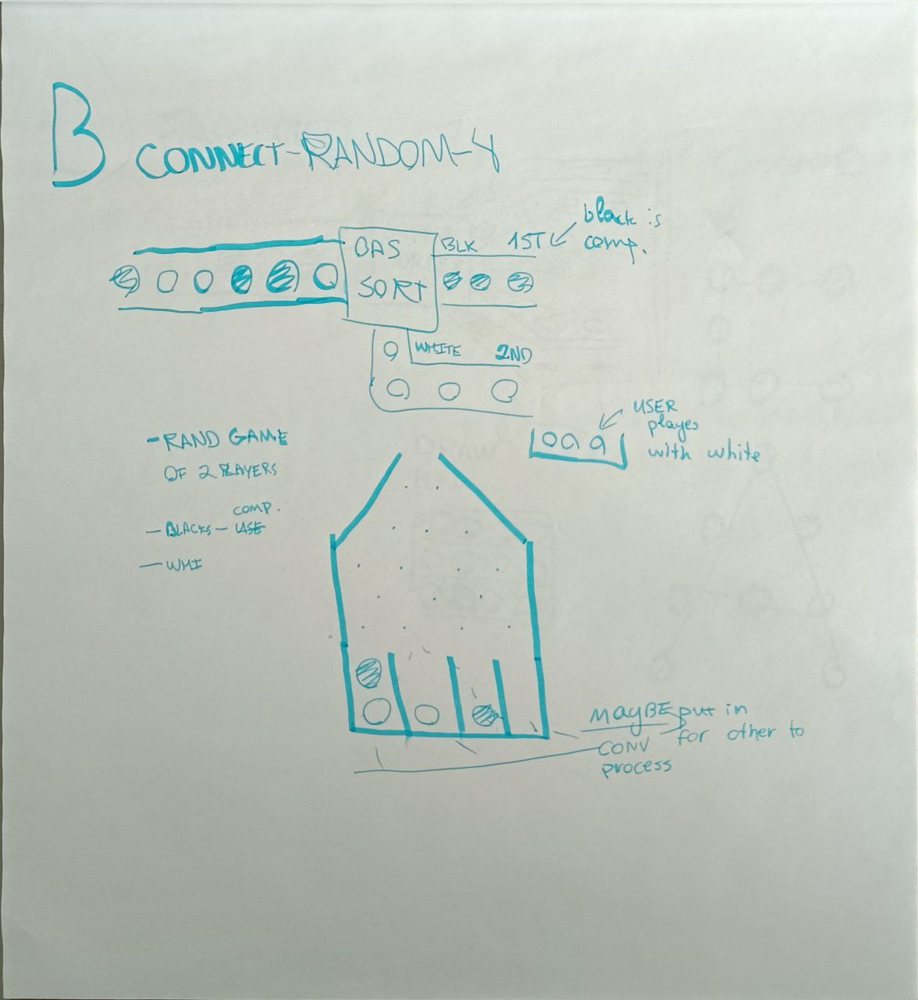

**Init idea:**

A sequence of baggages colored black and white is inputted. The robot sorts them by color (white / black). A robot and a player play connect 4 game against each other using sortted pieces.

**Possible issues:**

- For the robot to be autonamous no user be present. Therefore user player cannot exist.
  - **Solution(s):**
  - Instead of user against robot. Its gonna be robot against robot.

- How we determine where the robot places its piece?
  - **Solution(s):**
  - For simplicity sakes, the robot randomly plays using a peg board.

- How do we determine the game has ended?.
  - **Solution(s):**
  - A camera looking at the board determines what game state we are in currently.

- What happens when the game is over.
  - **Solution(s):**
  - A convayer belt below picks all baggages after the lever (to drop all pieces) is pushed.

**Revised idea:**

A sequence of baggages colored white and black are inputted. A basic sorter sorts them by white and black. Player 1 (user) uses white baggage as pieces. Player 2 (robot) uses black baggages as pieces. Both play a connect 4 game using a peg board. This makes the input to the game random.

**Alternatively:**

Instead of having user play with white baggages. Have both random robots play against each other.

### Other ideas

Other ideas were discussed but weren't relevant enough to be written here.

## First Meeting [23 Apr 2024]

We chatted with neigbouiring group 33. We decided to work with for now but the whole group hasn't yet decided.

We created a github repository for managing all documents, like decision list, minutes, and logbooks. And added all team members.

We started to brainstorm ideas:

**ideas:**

- [ ] **NFC tagged baggage**. Where NFC indicates where the baggage should go. Similar to how baggage is transported do different planes.
- [x] **Weight sorting**. Customized baggage with different weight distrubtion, based on it sort them.
- [x] **Main brain system**. A system which dictates other sub-subsystems adjacent to it.
- [x] **Morse code ouput**. A robot that outputs baggage in a way to display morse code.
- [ ] **Rotating table of baskets**.
- [x] **Water convayerbelt**. Have boats that transport baggages.
- [x] **Binary Addition**. Inputting in a black/white baggages in coresponding way outputs a result of addition in binary.
- [x] **Lost & Found Storage**. Sort baggages in some way and using vertical space as storage (done via elevator)
- [x] **Carwash**. A robot sorts baggage into clean and dirty. Then all dirty baggages are getting cleaned like a carwash.
- [x] **Platics warpper**. From NFC those baggages that are type wrap are wrapped and then sorted somewhere else.
- [x] **Alphabet sorter**. Each baggage has a letter assigned the robot sorts by letter then from user input outputs the correct text. This idea can be extended to work with the other group that manages storage related functionality.

**Possible cool features that can be implemented:**

- Screen display feature, to show users any addition
- Using NFC we can store more detailed information about the baggage.
- Elevator, Catapult, Zipline.

- Scrum Masters were decided:
  - Eusebiu Puşcă
  - Alexia Miliganu
