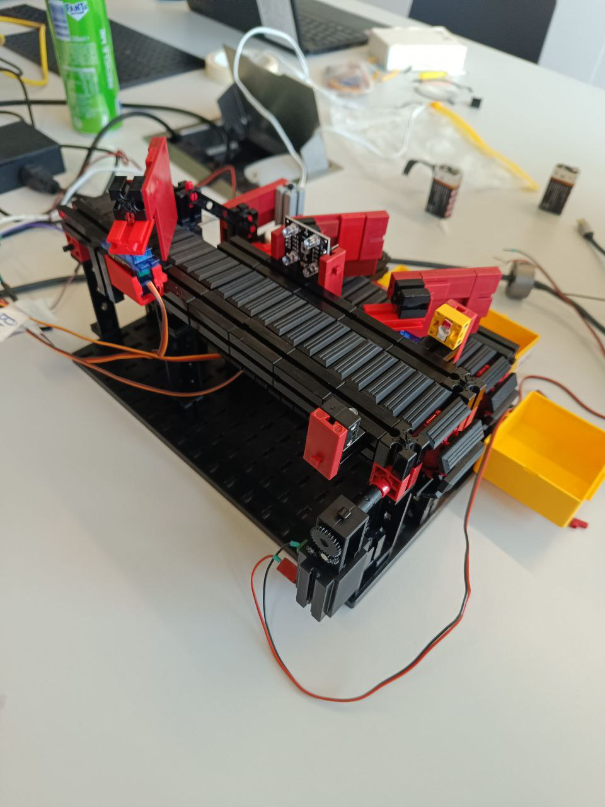
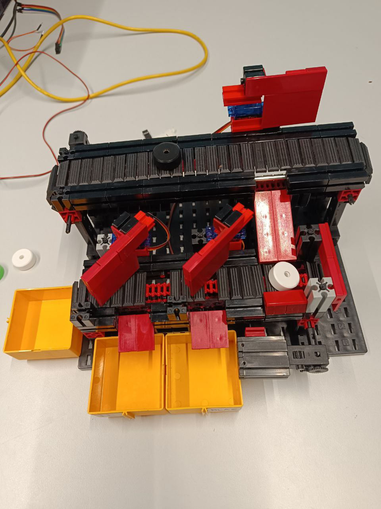
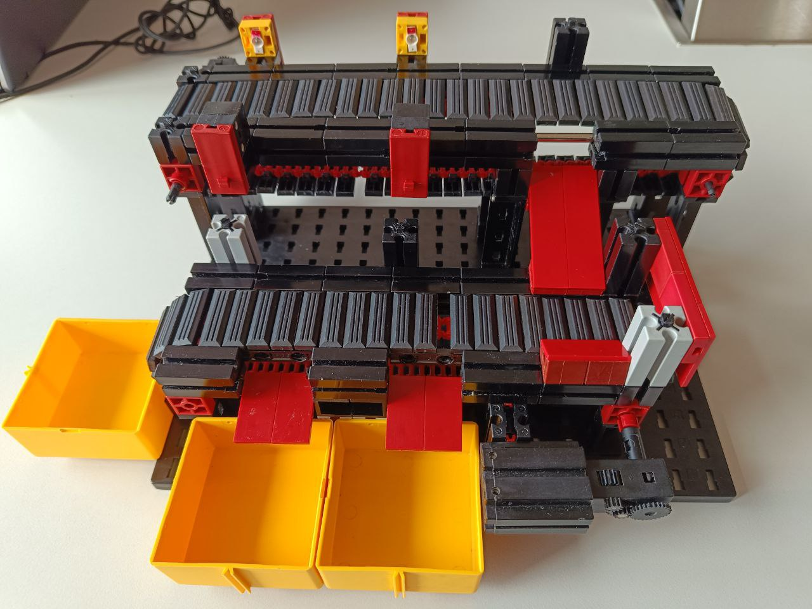
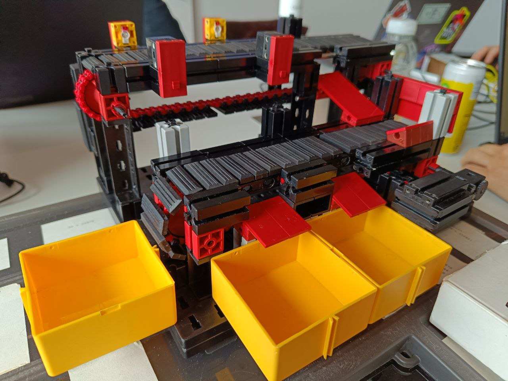
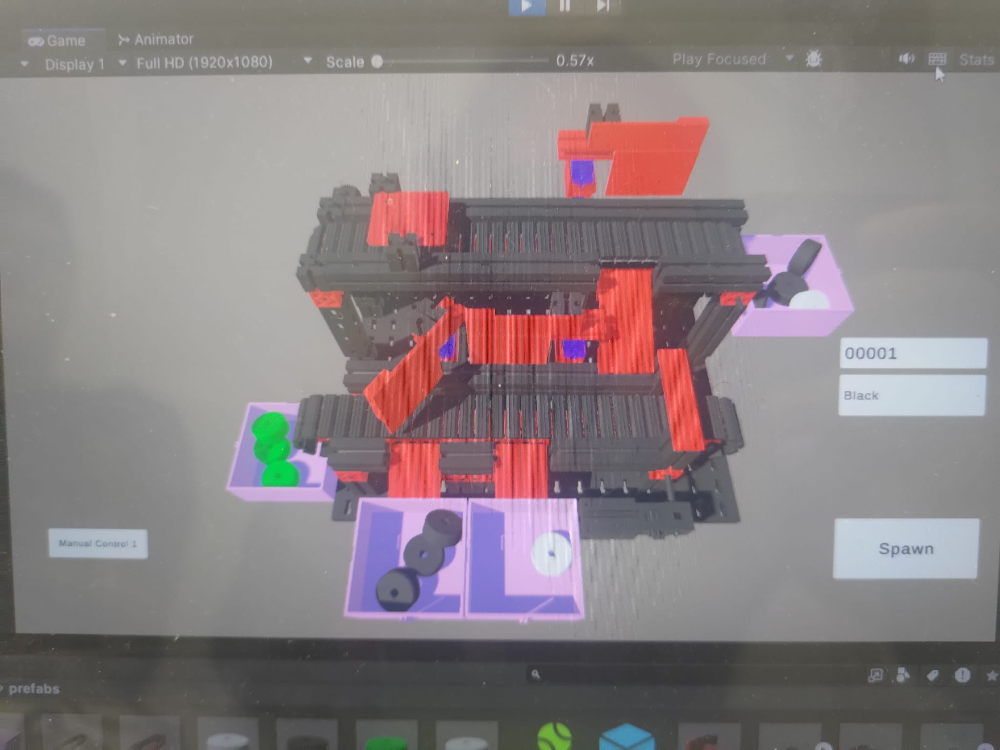
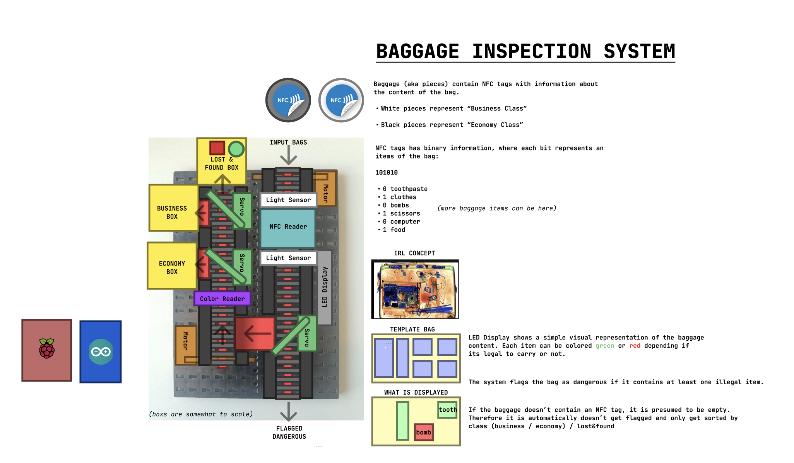
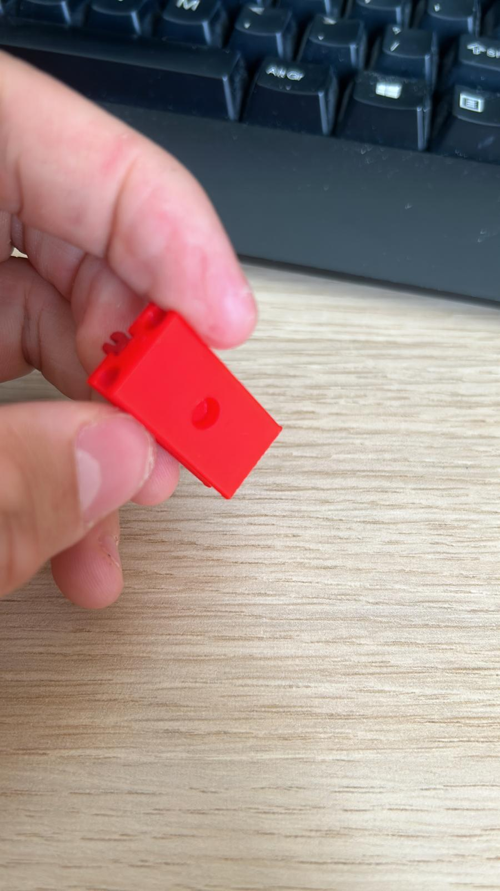
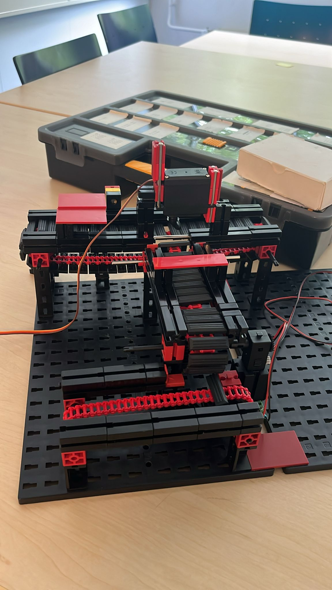

# Minutes of Meetings

Maintained by: Amir Nurmukhambetov (1930907)

## Twenteeth Meeting [4 June 2024]

Today in the morning we met up with Georgi, we discussed what we have currently and what we need to finish. We have to pick up a pace with finishing everything else. At the start we assigned tasks for each person. As previosly most of the work was on Balint.

- Balint got light sensors (photo resistor) to work, after that went on to help Eusebiu with servo code.

https://github.com/2IO75-group-34/reports/assets/60090566/dd2201b8-fdc0-4a41-9a3a-f0de25e99874

- Eusebiu worked on servo logic code and with the help from Balint got them to work as well.

- Amir (me) and Joep worked on color sensor. After reading documentations Amir (me) went on implementing code for it, and Joep started on wiring it with raspberry pi. After some help from Balint and couple of debugging color sensor began to work, except it can detect red well, but green or blue are ignored. Additionally white and black can be detected very well. Then Amir (me) attached color sensor to the robot.

- Ibrahim and Alexia worked on fixing couple of issues with physical robot. Alexia managed to resolve jamming problems in conveyer belt and Ibrahim placed conveyer belt pieces, so that the conveyer belt doesn't have holes.

For last hour we wired servos to the robot, and checked if the setup works. Down below is demo of servo working.

## Nineteenth Meeting [3 June 2024]

- We are currently stuck with NFC, so Balint started working on light sensors (photo resistors). Some progres was made, where black baggages do block most of the light (shows low ~0.02 voltage) but white baggages show (~0.7 voltage) which is not ideal. We expect that no matter what object blocks the light sensor we can detect it.

- Joep brought new custom pieces for the servos, some adjustments was needed for servos to attach but finally the physical robot is built!

- Amir (me) attached the servos. Then I started to work on light sensors with Balint.

- Eusebiu started working on merging C# code from unity to C++. Most of the motor logic was implemented. Balint looked over the code and did some refactoring with Eusebiu.

- Alexia worked on final documentation.

## Eighteenth Meeting [31 May 2024]

- Eusebiu got the simulation working! The digital twin is identical to physical robot and demonstrates that the concept works as it should.

https://github.com/2IO75-group-34/reports/assets/60090566/5f854fd4-7779-4e53-9d99-49f416464578

- Today was last open shop day, Ibrahim went there and got last missing pieces required to have stable conveyer belts.

- Amir (me) after reciving missing pieces, finished making the rest of the conveyer belt stable. Then I continued on working with light sensors.

- Balint worked on NFC, not much progress was done.

Current version of the robot.

## Seventeenth Meeting [29 May 2024]

- Balint continued working on NFC. NFC functinality works but the program is not extendible, so Balint worked on extending the library.

- Ibrahim finished with 3D model of the new design of the robot. Eusebiu ported new design + included newly made design of servo walls that pushes baggages. Unity simulation (digital twinning) is 80% done, whats left is having digital version of NFC working.

- Amir (me) started working on how light sensors works. I've included couple of links that were helpful:
  - different robot with sensor designs: <https://docs.fischertechnikclub.nl/profi/39574.pdf>
  - cool init demo on how light sensor should work: <https://www.youtube.com/watch?v=b7xY6nF-kI8&list=PLWTQPaDoIjN1sG_mnXk3FbZ4MnhaARvvm&index=12>

In addition after looking through couple of different designs, Amir (me) came across a way to make sure conveyer belts wont wobble. This feature I've implemented and now the belts are stable and won't sag in the middle + this makes conveyer belts higher allowing the baggage to block light sensors better.

Some parts we really need:

- **color recognition sensor**: <https://www.tinytronics.nl/en/sensors/optical/light-and-color/tcs3200d-tcs230-color-recognition-sensor>
- **infared break beam sensor**: <https://www.tinytronics.nl/en/sensors/optical/infrared/infrared-break-beam-sensor>
- **LCD Display**:
- some small fitcher technic parts:
  - **6x struct adapters**: <https://www.fischertechnik.de/en/products/spare-parts/structural-design/31848-strut-adapter-red>
  - **2x I-Struct with bore**: <https://www.fischertechnik.de/en/products/spare-parts/structural-design/36923-i-strut-with-bore-75-black>
  - **6x mounting plates**: <https://www.fischertechnik.de/en/products/spare-parts/building-blocks/38464-mounting-plate-15x60-red>
  - **4x 15 degree angle block**: <https://www.fischertechnik.de/en/products/spare-parts/building-blocks/angled-block/31981-angular-block-15-red>

## Sixteenth Meeting [28 May 2024]

Today we had a weekly meeting with Georgi and discussed about our final rubric, he pointed couple of things to change. Overall, everything going well.  

- After the last meeting, Balint made NFC reader to work. Firstly it worked on NFC keychains, but after some configurations we made it work on NFC stickers.

- Ibrahim finished working on 3D model of new robot design + made 3D models for the servo mountings. Eusebiu had some bugs in Unity and he was fixing them.

- Amir (me) worked on creating a servo mountings that would properly block and push baggages to designated places. Joep brought custom pieces designed to fit servos with fitcher technic pieces, but unfortunately the proportions were not good and they didn't fit well.

- Joep worked on updating our final rubric from Georigies feedback. After that he worked on redesigning custom piece for servos.

Some other things:

- we answered couple of questions of the other team (group 33).
- we looked through the internet on cheap displays.

## Fifthteen Meeting [27 May 2024]

Today not so much progress was done. Amir (me) and Alexia worked on updating our initial rubric for the "final rubric" assignement. Then Amir (me) went to help out Balint with NFC, and Alexia worked on how to use light sensors.

Amir and Balint found a tutorial that how to implement NFC chip with a raspberry pi. This tutorial was helpful, but we didn't have enough time to completely implement it.

Ibrahim and Eusebiu worked on digital twinning. Ibrahim worked on 3D model.

## Fourteenth Meeting [24 May 2024]

Amir (me) implemented a section where yellow containers should be, surprisingly there was enough just enough space to build everything. After which Amir (me) started to help out Balint with NFC. Amir (me) looked into the code, and Balint explained what was going on and what is the current issue.

<https://github.com/2IO75-group-34/reports/assets/60090566/d18f315a-9f2f-4b13-8541-7bd794b27d5d>

Eusebiu worked on the simulation, he added (digital) servo functionalites so now the baggages are pushed on command. In addition he made a manual control system to control the servos. Ibrahim worked on 3D modelling.

## Thirteenth Meeting [21 May 2024]

In the morning we had a meeting with Georgi. We discussed our current issues and what we expect to be done next week.

Amir (me) made a redesigned the robot concept. After which Amir (me) and Alexia worked on implementing it physically. We have finished with the building except there is one issue with pushing baggage to yellow containers due to lack of space.

Amir (me) brought couple of servos to play around with. Balint got them to work with raspberry PI.

Eusebiu and Ibrahim worked on digital twinning. Eusebiu managed to make a UI to easily add different types of baggages to the conveyer belt. Ibrahim researched ways to implement servos digitally. Additionally Ibrahim started remodeling 3D model to resemble the current robot.

## Twelfth Meeting [17 May 2024]

Todays meeting Eusebiu and Alexia got sick so they worked online.

We met up with Georgi and we have discussed how the project is going.

Joep also worked from home, but he created a 3D printed piece that can be attached on servos in addition allows fitcher technic pieces to also connect. Joep and Balint got NFC functionality working, with readable / writable NFC stickers. Last thing to do is to port libraries that work on Arduino boards to Raspberry Pi board.
    - We may actually not need to port anything, and just have the arduino board connected to raspberry pi. (this may be a more easier way, but indoing so requires proper communication between boards)

Balint also worked on making an abstraction for digital and physical parts software.

<https://github.com/2IO75-group-34/reports/assets/60090566/3d4a1968-7d19-416f-8c19-83e859e9c95a>

Ibrahim worked on Unity part, currently he designs a digital version of the current physical version. (due to constant redesigns + custom non fitcher technic parts, the 3D model can become outdated)

Amir (me) worked on physical robot. There is a potential redesign for the robot, where the middle conveyer belt can be removed, but the last conveyer belt can be extended more. This way the last conveyer belt has light sensor and servos to push things into buckets. This major redesign requires some thought, as it possible that it might hit the height limit of the robot. In addition we must clarify how the other team should receive the pieces.

At the last hour we have started working on presentation.

## Eleventh Meeting [15 May 2024]

In the morning, Balint, Amir (me), Eusebiu went to item shop to gather missing parts. While waiting in the line, Amir (me) fleshed out documentations. Alexia worked on conveyer belts.

Balint and Joep worked on configuring NFC stickers. We got NFC reader to work except it runs on an arduino board. We must figure out how to run it via raspberry pi.

Eusebiu continued digital twinning, we managed to fix git versions, and now everyone has latest version of code. Additionally Eusebiu and Balint started working on Software Abstraction with physical and digital parts.

Amir (me) and Alexia continued working on building conveyer belt after receiving all missing parts we changed the gears in some conveyer belts which made it work alot better (no slack, no jamming). By now the conveyer belts work reliabily, next we will add servos and light sensors.

## Tenth Meeting [14 May 2024]

Today, we met up with the neigbouiring team to discuss how we should do the communication challange. We explained our concept of NFC tags and our current progress with it.

In tangent we found out our current NFC stickers are too big (25 mm) for the baggages (20 mm), which would be a problem in the future, but right now we have to understand how to work with them.

Amir (me) started to list out missing parts that we need for tomorrows item shop.

**missing parts**

- block 30
- block 15
- gear wheel T20 (Art no. 031021)
- Servo lever (Art no. 132004)
- Driver servo arm (Art no. 203658)
- Cog wheel Z10 M1,5 (Art no. 035112)
- Collet chuck (Art no. 035113)

Amir (me), Balint, Eusebiu discussed how the software integration with physical parts and digital parts could be abstracted so that it would be easier to iterate without changing much code between two.

Balint, Eusebiu, and Ibrahim worked on digital model. We met an issue with git version control. After which Amir (I) joined to help out with it also.

Then, we have worked on fleshing out documents for tomorrows deadline.

## Ninth Meeting [13 May 2024]

Today, during the beginning of the meeting we couldn't find the locker with parts. But after a while we found them.

Balint, Joep continued working with NFC.

Eusebiu, Ibrahim continued working on making digital model of the prototype.

Alexia and Amir (me) worked on implementing design. We have noticed that sometimes the conveyer belts get caught and start to jam. We have lowered one of the conveyer belts + changed structure of the design.

## Eighth Meeting [7 May 2024]

Today unfortunately the raspberry pi got broken, so we had to get a replacement for it. Balint configured the new raspberry pi again to got working as previous.

A possible problem which might have caused this is inproper wiring which caused it to short circuit. We would be more careful next time.

Joep finished working on the prototype design (working belts) but we couldn't test if it works because of current raspberry pi issue.

Ibrahim, Alexia, Eusebiu continued working on Unity.

Joep worked on how NFC works, we managed to write data to the NFC tag.

## Seventh Meeting [6 May 2024]

Today, Eusebiu, Alexia, and Ibrahim continued working on Unity (Digital Twinning Challenge).

Amir (me) and Joep started on implementing figma design in real life.

Balint continued working on motors and software related part.

## Sixth Meeting [3 May 2024]

Today, we did the retrospective part of the meeting. After that we discussed the new model and progress of our project with Georgi. Georgi told us that we should distribute the tasks and everyone should assign themselves on a task on trello

Joep built two more conveyor belt parts.

Afterwards, Balint adjusted the code to operate multiple motors we attempted to make 4 motors work simultaneously. Although 2 motors successfully ran together. We could not manage to get 4 of them working at the same time.

Some debugging attempts later Balint managed to get 4 motors working simultaneously.

## Fifth Meeting [30 Apr 2024]

Today we discussed the privoted idea with Georgi and it was approved with some slight modifications (renaming things etc).

Balint got the motor and servo working with PWM and continuous motion. After which he started writing documentation on his work. It can be found on this [repo](https://github.com/2IO75-group-34/friendly-guacamole)

Eusebiu and Alexia completed the backlog.

I (Amir) and Joep worked on redesigning the robot so that it was more realistic in scale and used less parts. This allowed us to have a better understanding of what parts we need.

Joep, Balint, Amir, and Eusebiu started working on making a prototype design for the conveyer belt.

After which Eusebiu recorded a pitch video demonstration of our idea.

- [Youtube link](https://www.youtube.com/watch?v=dQw4w9WgXcQ)

## Fourth Meeting [29 Apr 2024]

Georgi has notified us that the idea **Hangman** doesn't represent a airport baggage system. We have pivoted the idea towards **baggage screening control system**.

The basic premise of this idea is that the baggages are checked for their content. If the system detects a malliscious item then it gets flagged and is sent to the other team (or placed into flagged box). If the baggage is good, it get sorted into to classes: business and economy. If the bag is special it is considered to be personale baggage.

Balint got the LED to work with the raspberry pi and arduino board. Motors and servos are in process, the current issue that we are facing is that the power for them are not compatible with the arduino board and raspberry pi.

Joep, Eusebiu and Alexia worked on filling out the backlog.

## Third Meeting [26 Apr 2024]

- Everyone has done scrum quiz.

- Eusebiu and Alexia started to document scrum planning. While everyone suggests their thought.

- We have decided on tackle these challanges:
  - Simulation-in-the-loop testing and digital twinning
  - Communication protocols

- Everyone worked on filling out the rubric (based on the challanges mentioned above).

- Mentor agreed on idea **Hangman**

We brought the parts from the locker to play with it. Balint decided to start to configure arduino board to work with the raspberry pi so that the motors work. The rest watched a video showcasing how to connect and assemble FischerTechnik pieces.

Video(s):

- [How to Use FischerTechnik Systems](https://www.youtube.com/watch?v=OtKxWEv9YuA)

At the end, Balint took raspberry pi and arduino board home to work on it in more. I (Amir) took all pieces to see whats possible and how viable our idea. Eusebiu and Alexia decided to start learning how to 3D model.

## Second Meeting [24 Apr 2024]

Went through ideas:

### Binary Addition

**Init idea:**

two sequences of baggages representing each number are added and the result is displayed as a sequence of baggages. Then its get sorted.

**Possible issues:**

- How do we determine when the sequence is stopped for a certain number?
  - **Solution(s):**
  - A set sequence of 8bit would be inputted.
  - If no baggage is received for after a certain threshold then it is considered as black = 0.
  - We won't limit ourselves to two numbers, any amount can be possible.

- A situation may occur where the number of white or black baggages are not enough to represent the summed result.
  - **Solution(s):**
  - Display the result using an LED screen display.

- How do we resolve if the baggages arrive too quickly? More specifically they are clustered and the space in between each baggage is different.
  - **Solution(s):**
  - Don't disturb the sequence make sure the **color reader** is fast enough to determine bit.

- Since the reviewer doesn't control the input the sequence is random. And so the result of addition can't be controlled.
  - **Solution(s):**
  - Before adding the sequence display the number that the 8bit chunk represents.

**Revised edition:**

Robot that reads a sequence of baggages in white/black. Each bag represents a bit either 1 or 0 depending on its color. A sequence is split in 8bit chunks and all are summed. The result is displayed on a LED screen display, and latest number added is shown. After processing the bagges are sorted by color.

### Alphabet Sorter

**Init idea:**

A sequence of baggages with english letters on each are inputted. The robot determines which letter is on each baggage after which stores is in a basket for a specific letter. The user would input the word they would like to display, after which the robot would output baggages with letters in a specific order such that the sequence shows the text user inputted.

**Possible issues:**

- The english alphabet contains 26 letters, this would involve 26 containers for storage, this would take too much space.
- The robot must be autonamous, but this has a user prompt in the middle of the task, which is not allowed.
- What happens if the baggage doesn't contain a letter, or contains a symbol that the storage can't be place.

### HangMan

**Init idea:**

A sequence of baggages with english letters on each. A robot determines the letter on a bag. A screen display of the hangman game. The determined letter is checked if its contained in the word choosen, if true then the baggages are sorted by color, else if the letter is not in the word, the robot ignores them.

**Possible issues:**

- How do we determine the word for the hangman game? What happens if the word is guessed correctly?
  - **Solution(s):**
  - The robot contains a word pool from which it selects randomly.
- How to handle letters that can't be recognized?
  - **Solution(s):**
  - The baggage is set as not in word.
  - Perhaps the robot could display a recognition percentage. Showing how likely it thinks that the letter on the bag is a certain letter.

### Connect Random 4

**Init idea:**

A sequence of baggages colored black and white is inputted. The robot sorts them by color (white / black). A robot and a player play connect 4 game against each other using sortted pieces.

**Possible issues:**

- For the robot to be autonamous no user be present. Therefore user player cannot exist.
  - **Solution(s):**
  - Instead of user against robot. Its gonna be robot against robot.

- How we determine where the robot places its piece?
  - **Solution(s):**
  - For simplicity sakes, the robot randomly plays using a peg board.

- How do we determine the game has ended?.
  - **Solution(s):**
  - A camera looking at the board determines what game state we are in currently.

- What happens when the game is over.
  - **Solution(s):**
  - A convayer belt below picks all baggages after the lever (to drop all pieces) is pushed.

**Revised idea:**

A sequence of baggages colored white and black are inputted. A basic sorter sorts them by white and black. Player 1 (user) uses white baggage as pieces. Player 2 (robot) uses black baggages as pieces. Both play a connect 4 game using a peg board. This makes the input to the game random.

**Alternatively:**

Instead of having user play with white baggages. Have both random robots play against each other.

### Other ideas

Other ideas were discussed but weren't relevant enough to be written here.

## First Meeting [23 Apr 2024]

We chatted with neigbouiring group 33. We decided to work with for now but the whole group hasn't yet decided.

We created a github repository for managing all documents, like decision list, minutes, and logbooks. And added all team members.

We started to brainstorm ideas:

**ideas:**

- [ ] **NFC tagged baggage**. Where NFC indicates where the baggage should go. Similar to how baggage is transported do different planes.
- [x] **Weight sorting**. Customized baggage with different weight distrubtion, based on it sort them.
- [x] **Main brain system**. A system which dictates other sub-subsystems adjacent to it.
- [x] **Morse code ouput**. A robot that outputs baggage in a way to display morse code.
- [ ] **Rotating table of baskets**.
- [x] **Water convayerbelt**. Have boats that transport baggages.
- [x] **Binary Addition**. Inputting in a black/white baggages in coresponding way outputs a result of addition in binary.
- [x] **Lost & Found Storage**. Sort baggages in some way and using vertical space as storage (done via elevator)
- [x] **Carwash**. A robot sorts baggage into clean and dirty. Then all dirty baggages are getting cleaned like a carwash.
- [x] **Platics warpper**. From NFC those baggages that are type wrap are wrapped and then sorted somewhere else.
- [x] **Alphabet sorter**. Each baggage has a letter assigned the robot sorts by letter then from user input outputs the correct text. This idea can be extended to work with the other group that manages storage related functionality.

**Possible cool features that can be implemented:**

- Screen display feature, to show users any addition
- Using NFC we can store more detailed information about the baggage.
- Elevator, Catapult, Zipline.

- Scrum Masters were decided:
  - Eusebiu Puşcă
  - Alexia Miliganu
